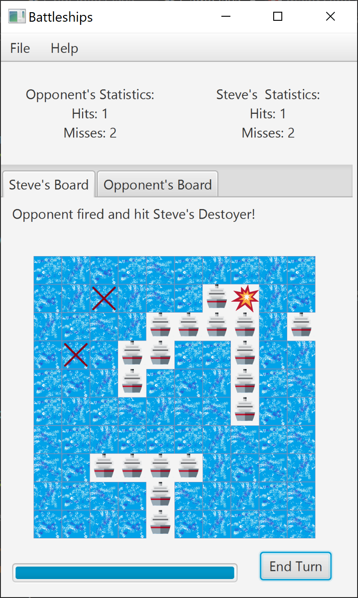

</a>

Battleships is a JavaFX implementation of the old school board game by the same name.  

<H2>Features Implemented:</H2>

•	JavaFX UI with tabbed view. 
•	Automatic random ship placement 
•	Collision detection algorithm prevents illegal ship placement. 
•	Saving and Loading system with filepickers 
•	Click to shoot (based on corresponding mouse location) 
•	Basic score keeping 

<H2>Todo:</H2>

•	Win condition 
•	Choose your own ship locations 
•	Play over a network 

<H2>How to Use:</H2>

To run the Battleships program, you simply run Battleships.exe.

you then will have options under the File menu for new game, save game and load game or quit.

New Game will randomly place a fleet of ships on the player grid and the opponent grid.  these grids are 
accessed using the tabs at the top for 'player' and 'opponent'.

to fire a shot, you simply click the place you would like to fire on the grid, the grid will update automatically
to show you if you have hit a ship or missed.

The game saves and loads to .sav files.  These files are not intended to be altered outside of the game environment.
